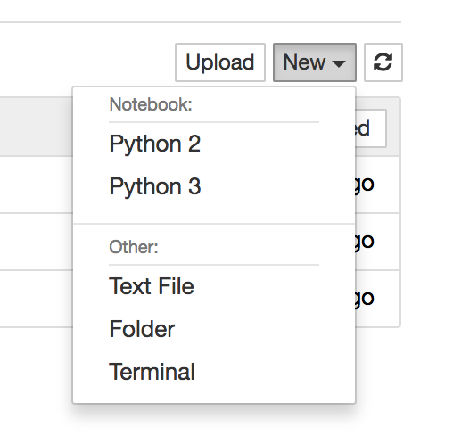
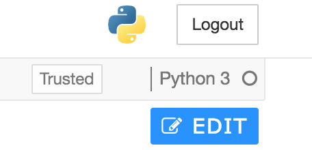
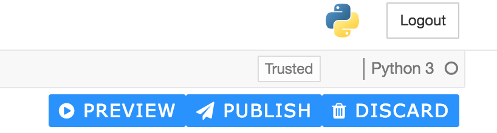
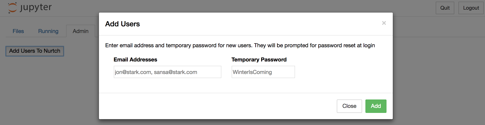
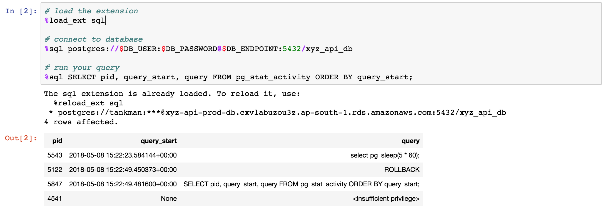
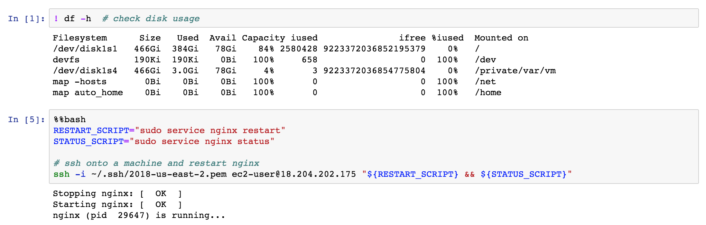

.. include:: ../globals.rst

Nurtch Platform
===============

Install
------------------
You can try Nurtch with a 30-Day free trial. |Sign up| for Nurtch to get your trial key and installation instructions.

Creating New Notebook
------------------------------------
Once you are set up and logged into Nurtch, you can create Notebooks/plain text files/directories. Click `New` and choose the appropriate option.

You can choose programming language while creating Notebooks. Thanks to Jupyter, Nurtch supports execution of |all major programming languages|. Python kernel comes installed out-of-the-box. For other language kernels |write to us| and we'll help you with the build.

Editing Notebook
------------------
Any Notebook is opened in the viewing mode by default. You can view content, execute code cells, and see output. Editing is disabled to avoid committing unintentional changes. Click on the `EDIT` button if you want to edit the Notebook.

Once editing is enabled you can modify the Notebook as you wish. After editing is done you can `Preview` the Notebook, if you are satisfied with modifications then `Publish` the changes to S3. At any time you can `Discard` your changes to go back to original version.

Add Users to Nurtch
---------------------
It's easy to invite your teammates to Nurtch. Go to the `Admin` tab after you login and click on `Add Users To Nurtch`.
Type in email addresses of users you want to add (separated by comma). Key in a temporary password for them to login with.

Once added these users can login with their email address and the temporary password. They are forced to change the password when they login for the first time.
Note that, we do not send email invites via Nurtch to avoid you any SMTP setup. Simply communicate the username (email) and temporary password to newly added users via your regular means of communication.

.. _run-sql-queries:

Run SQL queries in Notebook
------------------------------------
It's super easy to connect to any sql database and run queries against it from the Notebook. There's a |SQL magic| that helps you do it. See example below.

Run shell commands in Notebook
------------------------------------
You can run shell commands in the Notebook with the help of ``!`` operator. You can also use ``%%bash`` magic to run multi-line bash script.
Commands are run on the server where Nurtch is hosted. You can also SSH onto a different machine and run commands there from within the Notebook. See examples below.

