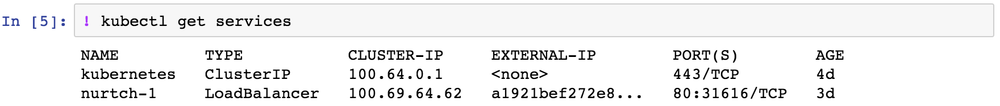

Kubernetes
===============
Now you can operate Kubernetes cluster from Nurtch notebooks.
You can either use the familiar `kubectl` commands or use higher level APIs provided by Rubix library.

Setup
------------------
Once you login, go to the admin tab and upload Kubernetes config file. The file is typically located at ~/.kube/config. *Tip: You might need to press (CMD + Shift + .) on mac to show hidden files in the finder.*

Once uploaded, wait for a minute for the config to propagate to all the nodes in your cluster. You can verify if the config is propagated as shown below.

That's it! Now you can use `kubectl` commands and `rubix.kubernetes.*` methods to operate your cluster (examples below).

Command Line Usage
---------------------
You can upload and use your existing scripts in the notebook or use one-off commands as shown in the examples below.

* List all running services.

* See when deployments occurred in your cluster by checking replica sets.

* Check the status of your last deployment.

API Usage
------------------
.. function:: get_latest_deployment_status(service_name, namespace='default', context=None)

   Retrieve metadata of last deployment on your Kubernetes service. Metadata includes deployment time, desired/available/current counts, container image etc.

   :param service: Name of your Kubernetes service.
   :type service: ``str``
   :param namespace: Namespace under which your service is running, if using namespaces.
   :type namespace: ``str``
   :param context: Context under which your service is running, if using context. Since context specifies the trio of (cluster, user, namespace) you don't need to specify namespace separately while using context.
   :type namespace: ``str``
   :returns: dict -- See response section below.

   :Response:
      * *desiredCount* (``int``)
         The desired number of replicas of the application.
      * *availableCount* (``int``)
         The number of replicas that are available to your users.
      * *currentCount* (``int``)
         The number of replicas that are currently running.
      * *createdAt* (``datetime.datetime``)
         The Unix time stamp for when the deployment was created.
      * *containerImage* (``str``)
         The name of container image + tag that got deployed.
   :Examples:

   .. code-block:: python

      from rubix.kubernetes import get_latest_deployment_status

      get_latest_deployment_status(service_name='nurtch-1')

   :Sample Usage and Output:
      .. image:: ../images/rubix_k8s_get_deployment_status.png
         :scale: 40%
         :align: center
